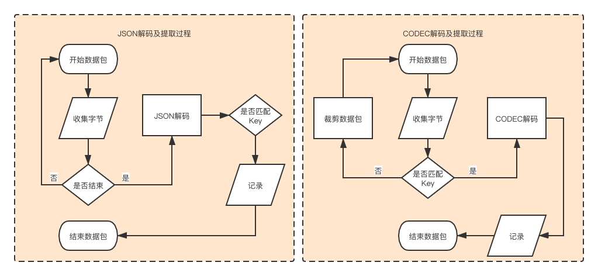
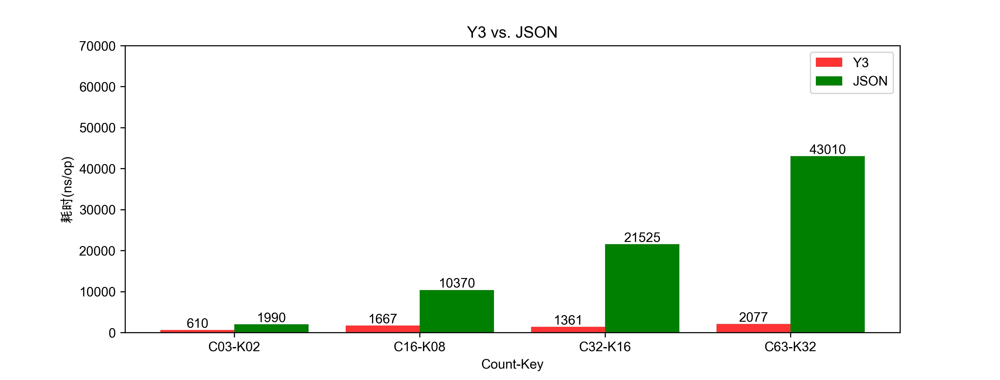
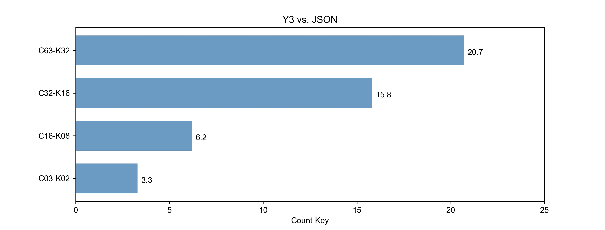
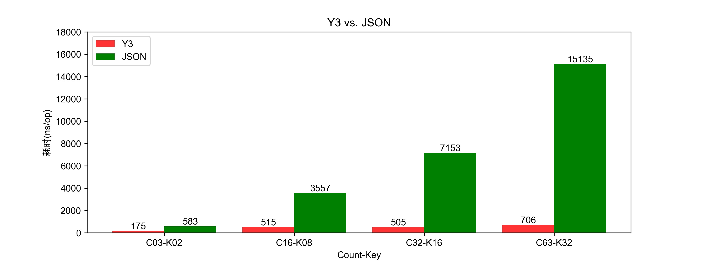
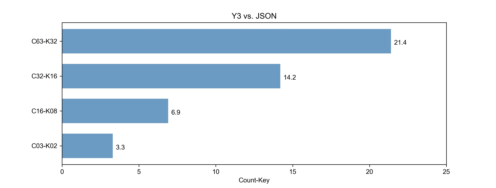
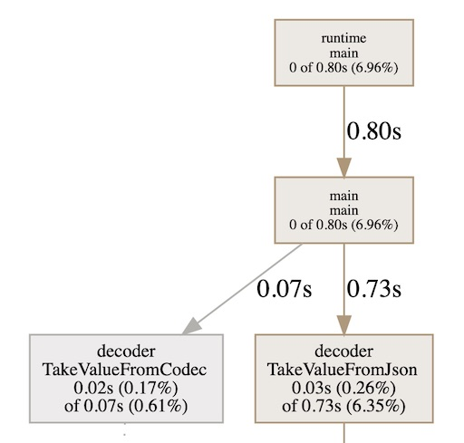

# YoMo介绍

​		[YoMo](https://github.com/yomorun/yomo) 是一套开源的实时边缘计算网关、开发框架和微服务平台，通讯层基于 [QUIC](https://en.wikipedia.org/wiki/QUIC) 协议 ([2020-09-25更新到Draft-31版本](https://tools.ietf.org/html/draft-ietf-quic-transport-31))，更好的释放了 5G 等下一代低时延网络的价值。为流式处理（Streaming Computing）设计的编解码器 [yomo-codec](https://github.com/yomorun/yomo-codec-golang) 能大幅提升计算服务的吞吐量；基于插件的开发模式，5分钟即可上线您的物联网实时边缘计算处理系统。YoMo 目前已在工业领域被部署应用。

官网： [https://yomo.run](https://yomo.run/)


# YoMo Codec 介绍

​		[yomo-codec-golang](https://github.com/yomorun/yomo-codec-golang) 是通过golang语言实现 [YoMo Codec](https://github.com/yomorun/yomo-codec) 的 [SPEC](https://github.com/yomorun/yomo-codec/blob/draft-01/SPEC.md) 描述 ；提供对`TLV结构`及基础数据类型进行编解码的能力，并且为 [YoMo](https://github.com/yomorun/yomo) 提供支持其消息处理的编解码工具。你可以为其扩展出更多数据类型的处理，甚至可以扩展并应用到其它需要编解码的框架中。

项目介绍：[README.md](https://github.com/yomorun/yomo-codec-golang/blob/master/README_CN.md)

## 为什么需要YoMo-Codec?

​		众所周知，在HTTP的通信中我们经常会使用JSON作为消息的编解码器，因为它格式简单，易于读写，支持多种语言，所以在互联网应用中很受欢迎，那为什么我们还需要自研YoMo Codec来支持YoMo的应用？

- YoMo对消息进行流式处理，从中提取受监听的key-value对进行业务逻辑的处理。 如果使用JSON进行编解码，会要求必须等待接收完整的数据包后才能对数据包反序列化为对象，再从中提取对应的key-value值；但对于YoMo Codec，通过把对象数据描述成一组`TLV结构`，在数据包解码时，可以在解码过程中更早的了解到当前的`T`是否为所受监听得key，从而判断是否直接跳到下一组`TLV结构`,而并不需要对非受监听的数据包进行多余的解码操作，从而提升了解码的效率。
- JSON的解码通常都使用了大量的反射，使得其性能会受到影响，而YoMo Codec因为只对实际被监听的key-value进行解码，实际反射的使用会大大减少。
- 对计算资源要求严格的网络应用中，对相同的编解码操作需要损耗更少的CPU资源，从而使有限的计算资源得到更充分的应用。

本次性能测试是为了验证YoMo Codec比JSON具有更高的数据解码性能的同时具有更少的资源消耗，从而为YoMo提供更为实时、高效、低损耗的消息处理能力。

# 测试说明

## 1. 测试方式

* 通过Benchmark进行基准测试，提供**串行**和**并行**两种方式，后者为了查看在充分利用CPU资源的情况下的性能表现。

* 被测试数据包通过程序生成，并保证Codec与JSON的测试使用的数据包含的key-value对的值完全相同。

* 被测试数据所包含key-value对的数据被分成**3对**、**16对**、**32对**、**63对**这几组，分别观察在不同key-value数量的情况下对解码性能的影响，而被监听的key值分别为其数量的中间值，如: K08表示监听第8个key的值。这样就会获得以下几个维度，之后在测试结果的图表中表达出来。

  | 符号表示    | Key-value的数量     | 被监听的key位置                  |
  | ----------- | ------------------- | -------------------------------- |
  | **C63-K32** | 共**63对**key-value | 监听提取第**32位**的key的value值 |
  | **C32-K16** | 共**32对**key-value | 监听提取第**16位**的key的value值 |
  | **C16-K08** | 共**16对**key-value | 监听提取第**08位**的key的value值 |
  | **C03-K02** | 共**03对**key-value | 监听提取第**02位**的key的value值 |

* 测试的结果内容包括：

  * 从数据包中解码并提取被监听key对应的value值的操作的性能比较。
  * 在相同的解码提取的场景中比较其占用CPU的时间。

## 2. 数据结构

* Y3 测试数据

  ```go
  0x80
      0x01 value
      ....
      0x3f value 
  ```

* JSON 测试数据的结构

  ```go
  {
      "k1": value,
      ...
      "k63" value
  }
  ```

## 3. 数据处理逻辑



## 4. 测试项目

* 本测试报告的代码均可从 [yomo-y3-stress-testing](https://github.com/10cella/yomo-y3-stress-testing)项目获得。

* 主要代码结构说明(只列举与本测试直接相关的文件说明)：

  ```
 
  ├── cpu
  │   ├── cpu_pprof.go											// 用于生成cpu的profile信息
  ├── docs
  │   ├── report_graphics.ipynb							// 生成Benchmark测试结果相关的性能比较图表
  ├── internal
  │   ├── decoder
  │   │   ├── codec.go											// TakeValueFromCodec 用于进行单次提取的测试
  │   │   ├── json.go												// TakeValueFromJSON 用于进行单次提取的测试
  │   │   ├── report_parallel
  │   │   │   ├── report_benchmark_test.go	// 通过Benchmark进行并行测试的代码
  │   │   │   └── report_benchmark_test.sh	// 进行并行测试并格式化测试结果，用于适配report_graphics.ipynb
  │   │   ├── report_serial
  │   │   │   ├── report_benchmark_test.go	// 通过Benchmark进行串行测试的代码
  │   │   │   └── report_benchmark_test.sh  // 进行串行测试并格式化测试结果，用于适配report_graphics.ipynb
  │   ├── generator
  │   │   ├── codec_data.go									// codecTestData生成Codec的数据集
  │   │   └── json_data.go									// jsonTestData生成JSON的数据集
  │   ├── pprof
  │   │   └── pprof.go											// 支持获取pprof信息
  ```

## 5. 测试环境

- 硬件环境：
  - CPU：2.6 GHz 6P intel Core i7，**GOMAXPROCS=12**
  - 内存：32GB
  - 硬盘：SSD
- 软件环境：
  - macOS Catalina
  - go version go1.14.1 darwin/amd64
  - [yomo-y3-stress-testing](https://github.com/10cella/yomo-y3-stress-testing)

# Benchmark测试

## 1. 串行测试过程

* 被测试代码：``./internal/decoder/report_serial/report_benchmark_test.go`，如：

  ```go
  // 针对YoMo Codec Y3进行基准测试
  func Benchmark_Codec_C63_K32(b *testing.B) {
  	var key byte = 0x20
  	data := generator.NewCodecTestData().GenDataBy(63)
  	b.ResetTimer()
  	for i := 0; i < b.N; i++ {
  		if decoder.TakeValueFromCodec(key, data) == nil {
  			panic(errors.New("take is failure"))
  		}
  	}
  }
  
  // 针对JSON进行基准测试
  func Benchmark_Json_C63_K32(b *testing.B) {
  	key := "k32"
  	data := generator.NewJsonTestData().GenDataBy(63)
  	data = append(data, decoder.TokenEnd)
  	b.ResetTimer()
  	for i := 0; i < b.N; i++ {
  		if decoder.TakeValueFromJson(key, data) == nil {
  			panic(errors.New("take is failure"))
  		}
  	}
  }
  ```

  * Benchmark_Codec_C63_K32：表示针对key-value为63组的数据集中提取第32个key的数据值，对此进行串行的基准测试。
  * 默认：GOMAXPROCS=12

* 启动测试脚本： `./internal/decoder/report_serial/report_benchmark_test.sh` 

  ```bash 
  temp_file="../../../docs/temp.out"
  report_file="../../../docs/report.out"
  go test -bench=. -benchtime=3s -benchmem -run=none | grep Benchmark > ${temp_file} \
    && echo 'finished bench' \
    && cat ${temp_file} \
    && cat ${temp_file} | awk '{print $1,$3}' | awk -F "_" '{print $2,$3"-"substr($4,1,3),substr($4,7)}' | awk -v OFS=, '{print $1,$2,$3}' > ${report_file} \
    && echo 'finished analyse' \
    && cat ${report_file}
  ```

  通过对report_benchmark_test.go测试文件运行benchmark基准测试，生成测试结果集并保存到`./docs/report.out`文件中。

* 生成结果图表：`./docs/report_graphics.ipynb`

  ```bash
  python --version # Python version > 3.2.x
  pip install runipy
  bar_ylim=70000 barh_xlim=20 runipy ./report_graphics.ipynb
  ```

## 2. 并行测试过程

为了最大限度的提高CPU的利用率，观察解码器在多核场景下的表现，增加了Parallel的测试项

* 被测试代码：``./internal/decoder/report_parallel/report_benchmark_test.go`，如：

  ```go
  func Benchmark_Codec_C63_K32(b *testing.B) {
  	var key byte = 0x20
  	data := generator.NewCodecTestData().GenDataBy(63)
  	b.ResetTimer()
  	b.RunParallel(func(pb *testing.PB) {
  		for pb.Next(){
  			if decoder.TakeValueFromCodec(key, data) == nil {
  				panic(errors.New("take is failure"))
  			}
  		}
  	})
  }
  ```

  * 代码与串行的主体相同，差别在于使用RunParallel来进行并行的测试
  * 默认：GOMAXPROCS=12

* 启动测试脚本： `./internal/decoder/report_parallel/report_benchmark_test.sh` 生成测试结果集并保存到`./docs/report.out`文件中。

* 生成结果图表：

  ```bash
  bar_ylim=18000 barh_xlim=25 runipy ./report_graphics.ipynb
  ```

## 3. 测试结果

* 串行Benchmark测试结果：

  - 单次解码提取的耗时比较：图3.1

  

  - Y3与JSON耗时增长的比率：图3.2

    

  * 图表说明：
    * 图3.1的坐标：C63-K32，表示数据包中含有63对key-value，并且监听相同的第32位的key提取其value。
    * 图3.1的Y坐标：表示单次操作耗时的纳秒数。
    * 图3.2的X坐标：表示 (JSON解码耗时/Y3解码耗时)的增加倍数。如：43010/2077=20.07

* 并行Benchmark测试结果：

  * 单次解码提取的耗时比较：图3.3

    

  * Y3与JSON耗时增长的比率：图3.4

    

## 4. 测试分析

上述测试结果可见：

* Y3的解码性能比JSON有很大得提升，随着数据包中包含的key-value对越多，则性能提升越明显，平均有10倍的增长。
  *(20.7+15.8+6.2+3.3)/4=11.5*
  
* 利用多核进行并行解码，其ns/op的性能也有很大的提升。并行与串行对比有3倍的提升：
  
  |          | C63-K32 | C32-K16 | C16-K08 | C03-K02 |
  | -------- | ------- | ------- | ------- | ------- |
  | 串行测试 | 2077    | 1361    | 1667    | 610     |
  | 并行测试 | 706     | 505     | 515     | 175     |
  | 增长     | 290%    | 260%    | 320%    | 350%    |

# CPU资源分析

## 1. 测试过程

* 被测试代码： `./cpu/cpu_pprof.go`

  ```go
  func main() {
    dataCodec := generator.NewCodecTestData().GenDataBy(63)
    dataJson := generator.NewJsonTestData().GenDataBy(63)
    dataJson = append(dataJson, decoder.TokenEnd)

    // pprof
    fmt.Printf("start pprof\n")
    go pprof.Run()
    time.Sleep(5 * time.Second)

    fmt.Printf("start testing...\n")
    for {
      if decoder.TakeValueFromCodec(0x20, dataCodec) == nil {
        panic(errors.New("take is failure"))
      }
      if decoder.TakeValueFromJson("k32", dataJson) == nil {
        panic(errors.New("take is failure"))
      }
    }
  }
  ```
  
  * pprof.Run()：用于启动pprof
* 程序不断循环的对Y3和JSON进行解码，通过观察cpu profile的取样图观察其CPU的资源占比
  
* 运行测试：

  ```bash
  # 运行被观察代码，pprof默认启动6060端口
  go run ./cpu_pprof.go
  # 进行取样，通过8081端口观察分析图
  go tool pprof -http=":8081" http://localhost:6060/debug/cpu/profile
  ```

## 2.测试结果



## 3.测试分析

从上图可见，YoMo Codec Y3得解码对CPU资源的占用远远低于JSON，差值也有10倍以上(*0.73/0.07=10.4*)，这个观察与Benchmark可以对应上，对CPU资源占用低，同时解码速度也有质的提升。


# 测试结论

​		Y3较JSON的解码性能有一个数量级的提升，数据包中的key数量越多性能提升越明显，同时Y3对CPU资源的占用也有一个数量级的降低；通过本次的性能测试可验证YoMo Codec Y3的解码能力能够为YoMo或者其它需要高性能解码的场景提供实时、高效、低损耗的消息处理能力。
